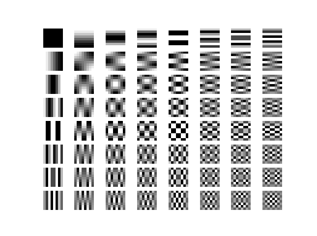

这篇文章虽是在h264系列里，耐不住JEPG wiki写得太nice了，所以忍不住引用进来
### JPEG 编码过程

DCT转换对于一般的编码格式都是极为重要的

下面简单介绍一下各阶段
* 1. ColorSpace Transform+DownSampling

    老生常谈的YUV420采样，编码压缩第一步。某些high quality encoder可能会保持在RGB空间(担心颜色空间转换时的损失呗)

* 2. Split

    分割Y Cb Cr的平面，分开编码，宏块对齐到8*8

* 3. DCT

    原输入的无损转换，本质是 $C=DID^T$, 坐标转换，将原图从空间域，转换到频域
  
    由于原图中能量最高的部分（信息量最大）一般都在低频区域，所以叫做*能量集中*

    此后都在DCT的频域上操作

* 4. Quantization(量化)

    降低频率信息的精度（这会影响熵编码时的开销）

    根据参考的编码质量（以及相关视觉研究结果），对图像各频率的数据采用不同的scale系数量化（h264也有scale list）


### II-DCT form

$$
D_{h,v}(m,n) = 2\sum_{m=0}^{M-1}\sum_{n=0}^{N-1}\frac{1}{\sqrt{M}}\frac{1}{\sqrt{N}}\eta_h\eta_{v} \cos{\frac{\pi h}{2M}(2m+1)}\cos{\frac{\pi v}{2N}(2n+1)}
$$


#### 可视化频域



[*code which gen this*](https://dsp.stackexchange.com/questions/58636/what-are-the-cosine-functions-in-jpegs-dct-ii-table)
```python
import numpy as np
import matplotlib.pyplot as plt

nRow = 8
nCol = 8
nFreqHoriz = 8
nFreqVerti = 8
normFreqDC = 1/np.sqrt(2)

for iFreqH in range(nFreqHoriz):
    for iFreqV in range(nFreqVerti):
        iFreqHoriz = iFreqH
        iFreqVerti = iFreqV
        matFreq2D = np.zeros((nRow,nCol))
        for iRow in range(nRow):
            for iCol in range(nCol):
                iRow0 = iRow
                iCol0 = iCol
                matFreq2D[iRow,iCol] = 2/(np.sqrt(nFreqHoriz)*np.sqrt(nFreqVerti))*np.cos(np.pi*iFreqHoriz*(2*iRow0+1)/(2*nRow))*np.cos(np.pi*iFreqVerti*(2*iCol0+1)/(2*nCol))
                if iFreqHoriz == 0:
                    matFreq2D[iRow,iCol] =  matFreq2D[iRow,iCol]*normFreqDC
                if iFreqVerti == 0:
                    matFreq2D[iRow,iCol] =  matFreq2D[iRow,iCol]*normFreqDC
        print(np.sum(matFreq2D**2))
        plt.subplot(nFreqHoriz,nFreqVerti,8*iFreqV+iFreqH+1)
        plt.imshow(matFreq2D, cmap='gray')
        plt.axis('off')
plt.show()
```