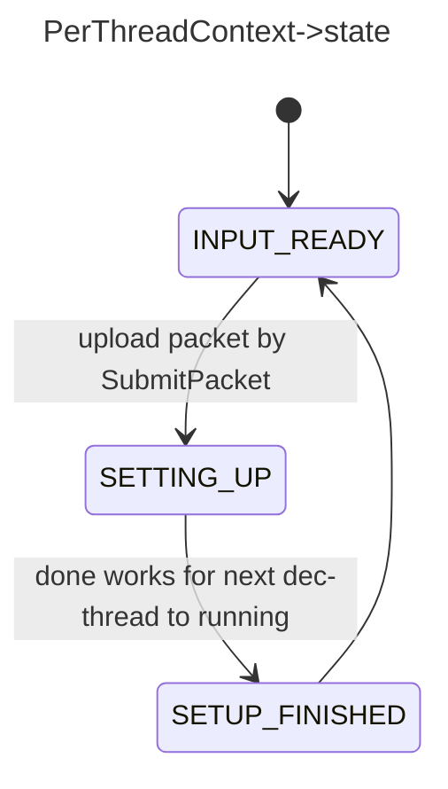

*   `FrameThreadContext` related to every `PerThreadContext` in each decoding\_threads

*   each `PerThreadContext` maintains own copy of original `AVCodecContext`, `update_context_from_thread` will update its state in case of data-changing passing from previous thread to next thread, such like `SPS/PPS` data, see `ff_h264_update_thread_context`

### PerThreadContext->state

| state           | means                                                                    | analyze                                                                                                                                                                                                                                                                                                                                                                      |
| --------------- | ------------------------------------------------------------------------ | ---------------------------------------------------------------------------------------------------------------------------------------------------------------------------------------------------------------------------------------------------------------------------------------------------------------------------------------------------------------------------- |
| INPUT\_READY    | cur thread ready for receive next packet                                 | Submit Thread (after checking if `prev_thread` and `prev_thread` leaving `SETTING_UP` which means context of current decoding thread is not fully ready) upload input `AVPacket` and Entering `SETTING_UP`                                                                                                                                                                   |
| SETTING\_UP     | cur thread is on the process of setting context for next decoding thread | If this codec got no `update_thread_context`, means it's decoding process of each frame is fully isolated. Then After dec-thread received one packet, changing to  `SETUP_FINISHED` is immediately.<br /><br />Otherwise, changing to `SETUP_FINISHED` should be done by codec->decode,  like happening after SPS Parsed, or multi-thread decoding will be meaningless<br /> |
| SETUP\_FINISHED |                                                                          |                                                                                                                                                                                                                                                                                                                                                                              |



### Sync codes

#### submit\_packet (thread which call avcodec\_send\_packet)

main function on stack

```log
submit_packet(PerThreadContext * p, AVCodecContext * user_avctx, AVPacket * avpkt) 
ff_thread_decode_frame(AVCodecContext * avctx, AVFrame * picture, int * got_picture_ptr, AVPacket * avpkt) 
decode_simple_internal(AVCodecContext * avctx, AVFrame * frame, int64_t * discarded_samples) 
decode_simple_receive_frame(AVCodecContext * avctx, AVFrame * frame) 
decode_receive_frame_internal(AVCodecContext * avctx, AVFrame * frame) 
avcodec_send_packet(AVCodecContext * avctx, const AVPacket * avpkt) 
```

```cpp
submit_packet(PerThreadContext * p, AVCodecContext * user_avctx, AVPacket * avpkt){
    pthread_mutex_lock(&p->mutex);
    
    // wait for previous thread setting done
    if (prev_thread) {
            while (atomic_load(&prev_thread->state) == STATE_SETTING_UP)
                pthread_cond_wait(&prev_thread->progress_cond, &prev_thread->progress_mutex);
    }
    
    // upload data and sync
    av_packet_unref(p->avpkt);
    ret = av_packet_ref(p->avpkt, avpkt);
    // this will block next thread, until relevant decoding-thread unlock this by calling ff_thread_finish_setup
    atomic_store(&p->state, STATE_SETTING_UP);
    pthread_cond_signal(&p->input_cond);
    pthread_mutex_unlock(&p->mutex);
    
    
    fctx->prev_thread = p;
    fctx->next_decoding++;
}
```

#### frame\_worker\_thread

```cpp
static attribute_align_arg void *frame_worker_thread(void *arg){
    thread_set_name(p);
    
    while (1) {
        while (atomic_load(&p->state) == STATE_INPUT_READY && !p->die)
            pthread_cond_wait(&p->input_cond, &p->mutex);
    
        if (!codec->update_thread_context)
            ff_thread_finish_setup(avctx);
        
        av_frame_unref(p->frame);
        p->got_frame = 0;
        p->result = codec->cb.decode(avctx, p->frame, &p->got_frame, p->avpkt);
        
        // in case of cb.decode does not take care of state changing
        if (atomic_load(&p->state) == STATE_SETTING_UP)
            ff_thread_finish_setup(avctx);
        
        atomic_store(&p->state, STATE_INPUT_READY);
    }
}
```

#### example: ffh264 calling ff\_thread\_finish\_setup

calling stack

```log
decode_nal_units(H264Context * h, const uint8_t * buf, int buf_size)
h264_decode_frame(AVCodecContext * avctx, AVFrame * pict, int * got_frame, AVPacket * avpkt)
frame_worker_thread(void * arg)
```

```cpp
static int decode_nal_units(H264Context *h, const uint8_t *buf, int buf_size){
    if (!(avctx->flags2 & AV_CODEC_FLAG2_CHUNKS))
        h->current_slice = 0;
    
    ff_h2645_packet_split();
    
    for (i = 0; i < h->pkt.nb_nals; i++){
        switch (nal->type) {
        case H264_NAL_SLICE: 
                ff_h264_queue_decode_slice(){
                    h264_slice_header_parse(h, sl, nal);
                    h264_slice_init(){
    					sl->slice_num = ++h->current_slice;
                    }
                }
                ff_thread_finish_setup(avctx);
                // see, decoding after passing signal of SETUP_FINISHED
                ff_h264_execute_decode_slices(h);
    }
}
```

